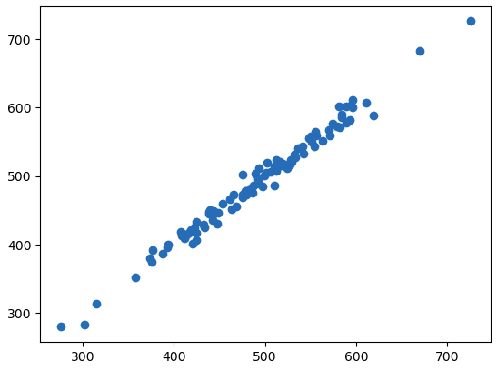

# Linear-Regression-Example

## 1. Problem
National Institutes of Health (NIH) has developed a mobile phone application and a website to enable citizens to make appointments and pay fees for vaccines, especially COVID vaccines, as well as other vaccines such as hepatitis B and meningitis. We want to decide which of these two platforms should be further developed to better reach citizens.

We will use the NIH_Customers.csv data:

 * Avg. Session Length: Average session length of in-person sessions in the hospital.
 * Time on App: Average time spent on the App (in minutes).
 * Time on Website: Average time spent on the Website (in minutes).
 * Yearly social security fee: The amount each patient pays yearly.

## Steps

The steps to be followed in this example are as follows:

1. **Importing the Required Libraries**  
   Loading and importing all the libraries to be used in the project.

2. **Exploring the Data**  
   Reviewing the basic characteristics and structure of the dataset.

3. **Visualizing the Data and Examining Correlations**  
   Visualizing key features in the data with graphs and analyzing correlations between variables.

4. **Creating Train/Test Data**  
   Splitting the dataset into training and testing sets.

5. **Training the Model**  
   Training the selected machine learning model with the training data.

6. **Making Predictions with Test Data**  
   Making predictions on the test set using the trained model.

7. **Evaluating the Model**  
   Assessing the model’s performance using appropriate metrics.

8. **Examining the Distribution of Residuals**  
   Analyzing and visualizing the distribution of the model’s prediction errors (residuals).

9. **Interpreting the Results**  
   Interpreting the results obtained and evaluating the outcomes.

---
## Model Evaluation

Below is a scatter plot showing the model's prediction results:

### Comparison of Actual and Predicted Values

In this scatter plot, the x-axis represents the actual test values, while the y-axis shows the values predicted by our model. The fact that the points are distributed close to the diagonal indicates that the model's predictions are quite close to the actual values. This demonstrates that our model performs well.

**Evaluation Metrics:**

- **MAE (Mean Absolute Error):** 7.29
- **MSE (Mean Squared Error):** 90.86
- **R² (R-squared):** 0.98

### Residuals Distribution

The following plot shows the distribution of residuals (the difference between actual and predicted values). A roughly normal distribution centered around zero suggests that the model's errors are unbiased.

## What is the conclusion?

**Should NIH focus more on the mobile app or the website?**

Based on the coefficient values:

- **Time on App Coefficient:** 38.77
- **Time on Website Coefficient:** 0.63

If users spend one more hour on the app, the yearly revenue increases by approximately 38.77 units.  
However, one more hour on the website only increases the revenue by 0.63 units.

**Conclusion:**  
NIH should focus more on developing its mobile app, as increased user engagement there has a much greater impact on yearly revenue compared to the website.

[You can find the detailed Python code here.](https://github.com/ebrar-7777/Linear-Regression-Example/blob/main/linear_regression.ipynb)

